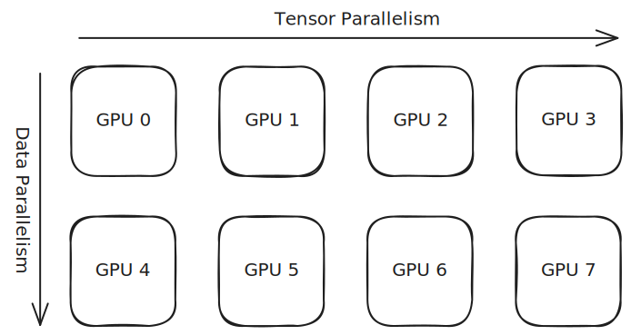

# Distributed Guidelines

A fundamental advantage of `Language-Model-SAEs` is its support of distributed setup, including data parallelism (DP), tensor parallelism (TP), some special parallelism strategy for some specific models, and their arbitrary combination. These strategies avoid OOM and accelerate model computation, making it possible for training arbitrarily large sparse dictionaries for frontier models.

## How does it work

!!! note

    If you don't care about the under-the-hood implementation of our distributed settings, feel free to skip this section. You can still use the distributed settings to speed up everything with ease.

We mainly take advantage of PyTorch [DeviceMesh](https://docs.pytorch.org/tutorials/recipes/distributed_device_mesh.html) and [DTensor](https://docs.pytorch.org/docs/stable/distributed.tensor.html#pytorch-dtensor-distributed-tensor) to organize distributed storage/computation and collective communication.

### DeviceMesh

[DeviceMesh](https://docs.pytorch.org/tutorials/recipes/distributed_device_mesh.html) is a multi-dimensional mesh structure that manages the distribution of computation across your devices (typically GPUs). Each cell in the mesh represents a single device, and each dimension of the mesh corresponds to a specific parallelism strategy.

<figure markdown="span">
  
  <figcaption>An illustration of DeviceMesh with 8 GPUs arranged in a 2×4 grid. This configuration uses Data Parallelism (DP=2) along one dimension and Tensor Parallelism (TP=4) along the other.</figcaption>
</figure>

DeviceMesh provides a standardized framework for implementing multi-dimensional parallelism. For each parallelism strategy, sharding and communication operations occur exclusively along the corresponding dimension of the mesh.

In the example above, the input data is split into 2 shards. GPUs 0-3 process the first shard, while GPUs 4-7 process the second shard. And for the TP dimension, model parameters are partitioned into 4 shards, distributed across GPUs within each data-parallel group (e.g., GPUs 0, 1, 2, 3 each hold one shard of the model).

This mesh abstraction allows you to compose different parallelism strategies cleanly, with each strategy operating independently along its designated dimension.

### DTensor

Built on top of DeviceMesh, [DTensor](https://docs.pytorch.org/docs/stable/distributed.tensor.html#pytorch-dtensor-distributed-tensor) provides an abstraction layer that enables you to work with distributed tensors from a global perspective.

DTensor requires your code to follow the SPMD (Single Program, Multiple Data) paradigm, meaning the same program executes across all processes. Under this model, any tensor created at a specific point in the program has a corresponding tensor in every other process at that same point.

When using regular tensors in distributed settings, these per-process tensors exist independently with no explicit relationship or coordination between them. DTensor addresses this by providing a unified, global view: it logically represents a single large tensor containing all the data across all processes, which is then automatically sharded and distributed to each process according to its `Placement` specifications.

### Application in Language-Model-SAEs

It does make the life easier to organize multi-dimensional parallelism with the help of DeviceMesh and DTensor. In most cases we just want to apply DP and TP. And that should be simple: DP is to add a `data` dimension to the DeviceMesh, and shard all the input data along the `data` dimension of the DeviceMesh and along the `batch` dimension of the data tensor. TP is to add another `model` dimension to the DeviceMesh, and shard all the parameters along the `model` dimension of the DeviceMesh and along the `sae` dimension of each parameter.

Ideally this should already work. But in practice, this cannot be the full story. Often a primitive of PyTorch does not know how it should deal with DTensor properly, or the implementation is not performant in distributed cases (not efficient or costs unnecessary extra GPU memory).